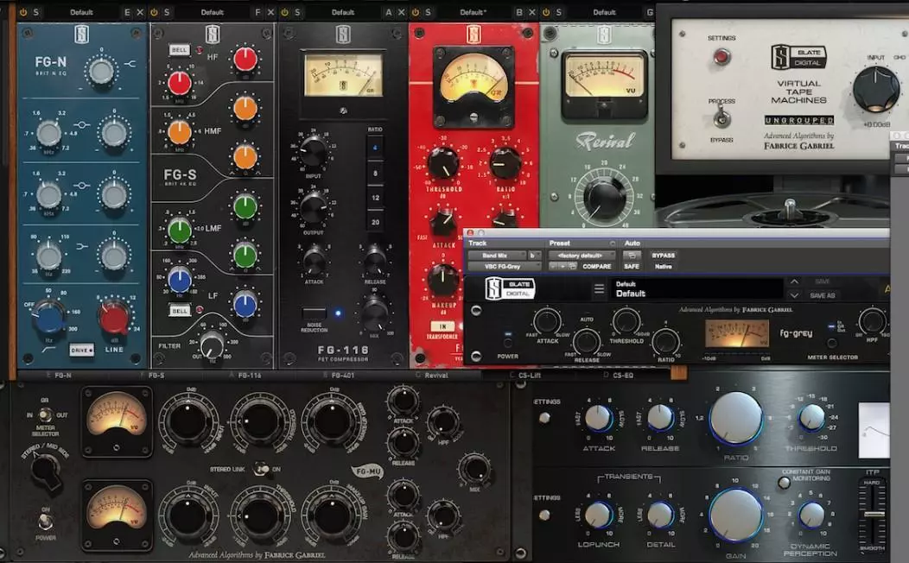

# Masterización Básica en Producción Musical 🎵

Bienvenido a esta guía sobre **masterización de audio**, el proceso final en la producción musical que mejora la calidad y uniformidad del sonido finál.

## ¿Qué aprenderás?
- ¿Qué es la masterización?
- Herramientas esenciales
- Técnicas básicas
- Mejores prácticas

##  Contenido
- [¿Qué es la Masterización?](seccion1/que_es_masterizacion.md)
- [Herramientas Esenciales](seccion1/herramientas.md)
- [Técnicas Básicas](seccion2/tecnicas_basicas.md)
- [Errores Comunes](seccion2/errores_comunes.md)

## Contenido adicional

**[Técnicas de Masterización](https://www.youtube.com/watch?v=KMb_rgv2bX4)**

**[Curso Gratuito de Masterización](https://topmastering.online/curso-de-mezcla-gratis/)**
